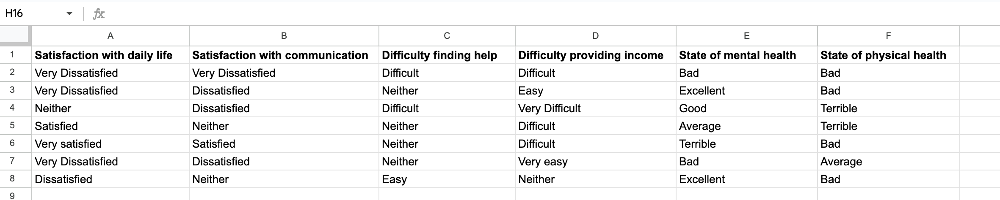
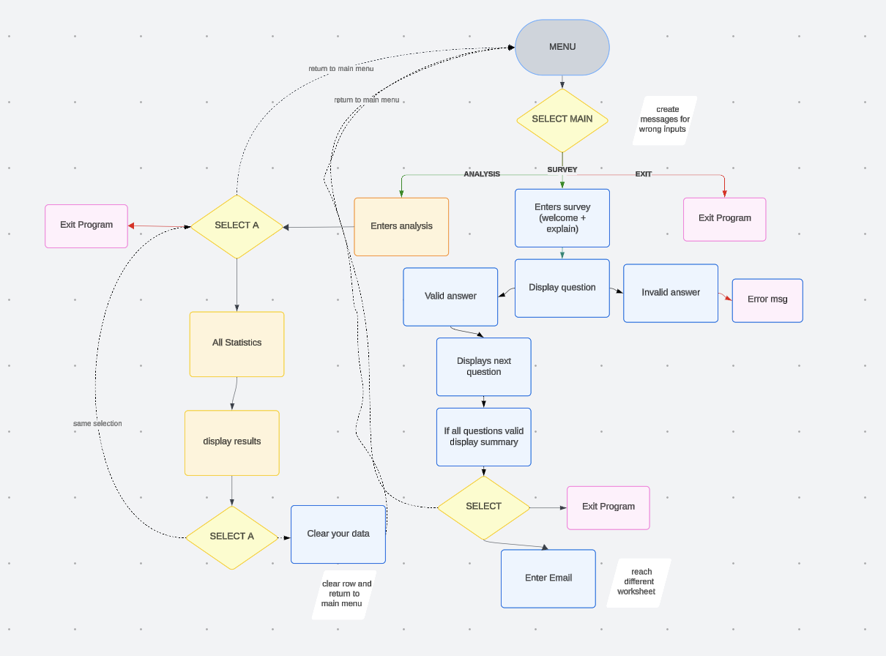
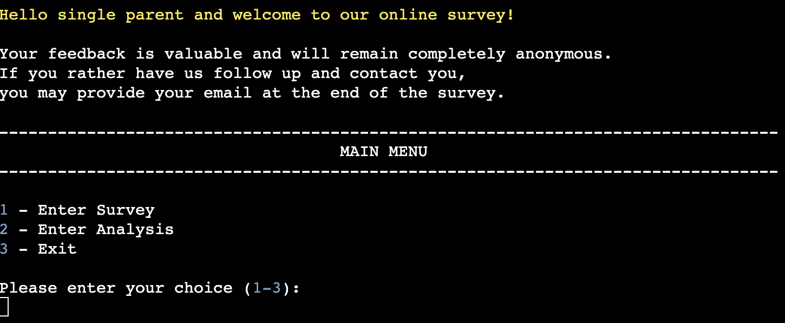
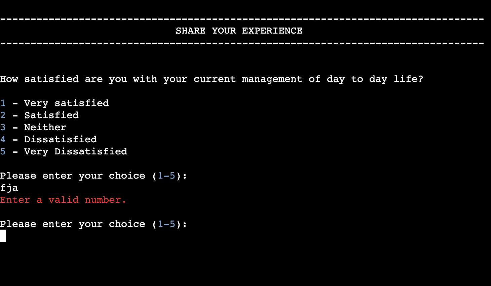
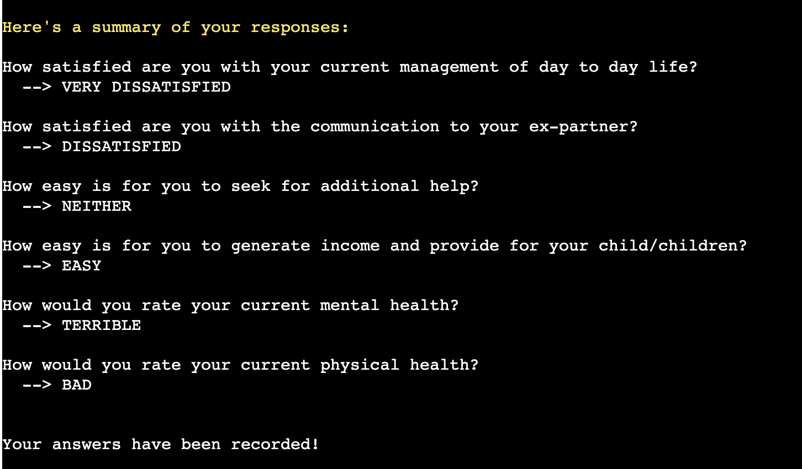
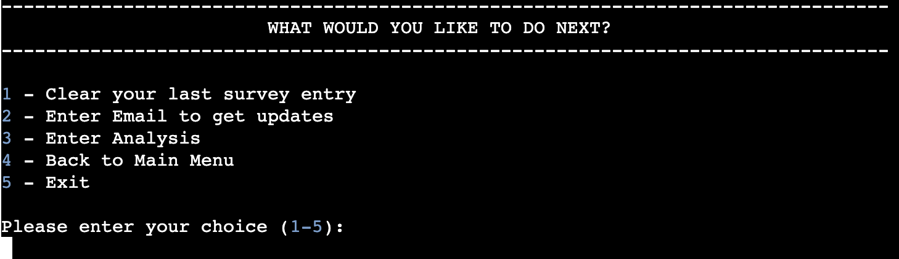
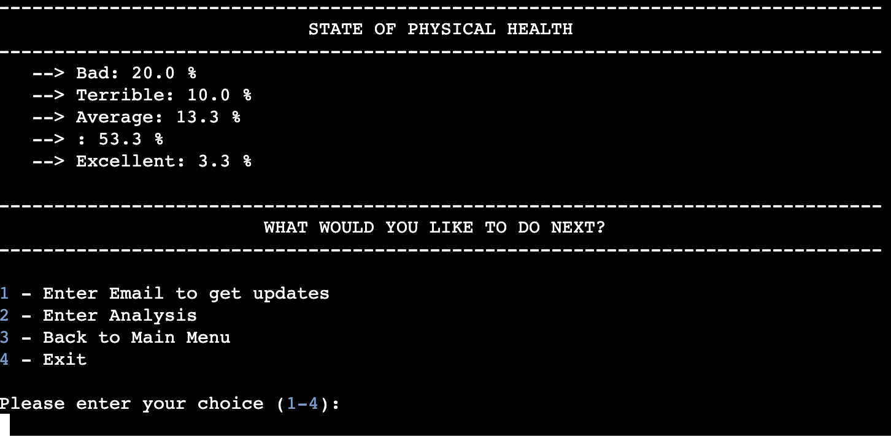

# Single Parent Survival Survey

## Table of Contents

- [Introduction](#introduction)
- [User Stories](#user-stories)
- [Source for Data](#source-for-data)
- [Features](#features)
- [Testing Debugging](#testing-debugging)
- [Deployment](#deployment)
- [Resources](#resources)
- [Thanks](#thanks)

## Introduction

Life as a single parent is a non-stop rollercoaster ride, complete with unexpected loops, financial free-falls, and occasional heartwarming moments. This [SURVEY](https://single-parent-survival-survey-c061280f5b45.herokuapp.com/) is designed to give single parents a voice while collecting real-time insights into their challenges and well-being.
This project is a Python-based interactive command-line tool that integrates with Google Sheets for real-time data storage and analysis.

## User Stories

### For Single Parents:

- As a single parent, I want to quickly and easily answer a short survey and get messages if I am doing it right.
- As a single parent, I want to remain anonymous while sharing my feedback. If I desire so, I will leave my email for further inquiries.
- As a single parent, I want a clear summary of my responses and the possibility for correction.
- As a single parent, I also want to know statistics on how others in similar situation feel. 

### For Researchers and Decision-Makers

- As a researcher, I need an dataset to effectively examine the experiences of single parents.
- As a support organization, I want a simple way to collect and view survey data for my initiatives.

Important - for this survey as I believe single parents also want to see how other replied i did not lock survey statistics with password.

## Source for Data

The collected survey data is stored in a [Google Sheet](https://docs.google.com/spreadsheets/d/10B_jIqGym3_6jQL0AYocgoCMzJwgzy0R1XbWou1d3Yg/edit?gid=0#gid=0), allowing real-time updates and easy access for analysis. This ensures that responses remain structured and exportable for further processing.

## Features

To establish the program’s framework, I started by designing a flowchart in Lucid. This visual guide enabled me to structure the application's navigation, illustrating how users move through the main menu, complete survey questions, and explore analysis features. It clarified the sequential processes, from presenting options and collecting responses to storing data and performing analysis using Google Sheets.

### Main Menu

*The Main Menu serves as a starting point for entering program and user journey.* 

Menu Structure and User Interaction

- Clear and Accessible Options: The menu is designed to display available choices in a structured and easily readable format, ensuring a smooth user experience. Each option is clearly labeled by blue color, making navigation intuitive, straightforward and adaptable for neurodivergent users.

- Dynamic Menu Management: The MenuOptions class is responsible for handling menu functionalities efficiently. Each menu option is encapsulated as an object containing its index, label, action message, and execution function. This modular approach enhances flexibility, allowing different menus to be created and managed consistently without redundant code.

- User Input Handling: When a user selects an option, the program displays an associated action message before executing the relevant function. This ensures immediate feedback, confirming the chosen action. Feedback and sucess messages are usually in color yellow for better UX.

- Reliable Execution System: Instead of iterating through a list, each menu option is individually instantiated and directly accessed. The run_select_option method executes the assigned function, ensuring smooth interaction without unnecessary complexity.

- Seamless Navigation: The structure allows for straightforward user interaction enhanced with color coding for better readability.

### Survey Section

*This survey is designed to provide single parents with an opportunity to share their experiences, challenges, and overall satisfaction with different aspects of their daily lives. By gathering this feedback, the tool aims to offer insights into common struggles and strengths within the single-parent community, helping to identify areas where additional support or resources may be beneficial.*

- Focused Question Display: Each question is presented individually, allowing single parents to reflect on their responses without feeling rushed. This approach ensures more thoughtful and accurate feedback.

- Well-Structured Data Organization: The survey utilizes dictionaries to store questions and answer choices efficiently. Each question acts as a ‘key,’ while the available responses are the corresponding ‘values.’ This structure makes it easy to expand the survey with additional questions in the future based on user feedback.

- Easy and Accessible Input System: The survey consists of single-choice questions, eliminating the need for lengthy responses. Based on CSAT, CES and 5-point Likert scale.

- Reliable Input Validation: To maintain data accuracy, the system includes built-in validation to ensure only valid responses are accepted. If an incorrect entry is detected, the user is prompted to try again, preventing errors in data collection.

- Instant Summary Review: After completing the survey, participants receive a summary of their responses. This feature allows users to review their answers before final submission, providing transparency in what is being recorded.

- Post-Survey Navigation: Upon finishing the survey, users have the flexibility to either proceed to another section of the program, clear entered data if they feel they made mistake, go back to main menu or exit. This ensures a smooth and logical transition between different features of the application.

### Analysis Section

*The analysis section is designed to transform raw survey data into meaningful insights. By examining the responses of single parents, this feature helps identify key challenges, levels of satisfaction, well-being areas needing support. The goal is to present a structured summary of the data, allowing for a better understanding of common struggles and positive experiences.*

- Interactive Analysis Menu: The analysis section provides a clear and structured menu, allowing users to explore collected data and return to main menu.

- Reliable Input Validation: Similar to the survey and main menu, the analysis section includes an input validation system. Users must enter a valid selection to navigate through the menu, ensuring smooth interaction and preventing errors.

- Summary of Responses: A concise yet detailed breakdown of survey results is provided. Total number of responses collected as a key indicator of participation levels. Also breakdown of satisfaction levels categorized into different levels of UXR methodology to help visualize trends.

- Post-Analysis Options: After reviewing the statistics, users can choose their next action - enter email to get updates, exit or go back to main menu. 

### Clear Last Entry

*Mistakes happen, and sometimes we change our minds. That’s why the program allows users to remove their last recorded survey entry if needed.*

- Functionality: Users can choose the "Clear your last survey entry" option from the post-survey menu.The program deletes the last recorded row from Google Sheets.A confirmation message is displayed to ensure users are aware of the deletion.If no entries exist, the program notifies users that there's nothing to delete.

- Error Handling: Ensures the Google Sheets API properly deletes only the last recorded entry.Prevents accidental deletion of more than one response.

### Email Collection

*Want to stay in the loop? This feature allows users to optionally enter their email to receive updates or future surveys.*

- Functionality: After completing the survey, users are offered to enter an email address.The system validates the email format to prevent incorrect inputs. Once validated, the email is securely stored in a dedicated Google Sheets worksheet. Users can opt to skip this step if they prefer to remain anonymous.

- Error Handling: Detects and rejects invalid email formats (e.g., missing "@" or incorrect domain endings).Prevents duplicate entries for the same email address.

### Features Left to Implement

- Credential-Based Access for Data Analysis - Restrict analysis results to authorized users only.

- Expanded Statistical Analysis - More in-depth trends and visualization.

- Automated Reporting - Generate PDF reports with insights from the collected data.

## Testing Debugging

*During the development process, I relied on Python Tutor to break down and visualize small code segments, helping me understand how different functions executed step by step. This tool was particularly useful for testing isolated pieces of logic, identifying potential errors, and ensuring that the expected outputs were achieved. However, when it came to refining and optimizing my code structure, I needed a longer solution so I turned to Perplexity, which provided insightful recommendations to debug the code. By combining both tools, I was able to debug effectively while also enhancing the overall maintainability and clarity of my code. Unfortunately, i forgot to take pictures during the process but u can find data in log messages*

*I was also doing a lot of python3 run.py testing to ensure everything is functioning*

- Menu Navigation & Flow: Checked seamless transitions between menus without breaking the user experience. This was not so easy as Heroku is not using os import so I will ahve to learn how to improve. Ensured that selecting an invalid menu option prompts an appropriate error message.

- Google Sheets Integration: Verified responses are stored in the correct worksheet. Tested data retrieval functions for accuracy in summary statistics.

- Survey Input Validation: Ensured only valid numeric inputs are accepted. Implemented and color coded error messages for incorrect inputs and retesting edge cases.

- Screen Clearing & Delays: This is a section i need to improve.

## Deployment

*The project was deployed to Heroku, making it accessible for users without requiring local setup. The whole Heroku journey was devastating, as I needed 4 days to get student status on both Heroku and GitHub. Wrote at least 7 emails to different supports and wasted time on something that should be not so hard. Finally when I got student credits I was able to deploy. (If u have same troubles write to me).*

## Resources

I used many different resources to create this Survey. Main guides in this process were similar projects by my fellow students [Sophie](https://github.com/SophieDufrane/PP3_Satisfaction_Survey?tab=readme-ov-file) and [Cat](https://github.com/catgriffin85/pp3-survey-results/tree/main). I was reading and examining their code in order to understand how is survey build. Examining code is the best principle for neurodivergent people like me.

Also for delaying program startup and cleaning screen I used online resources like [Mimo](https://mimo.org/glossary/python/time-sleep), [StackOverflow](https://stackoverflow.com/questions/29289945/how-to-temporarily-disable-keyboard-input-using-python) and [PythonBugs](https://bugs.python.org/issue11851).

I used Love sandwiches project to code along and learn how to implement Google sheets and also deploy. I used amazing interactive [Openstax](https://openstax.org/details/books/introduction-python-programming) book to easy learn python.

I used PythonTutor and Perplexity to debug and clean code.

## Thanks

Single parenting is one of the toughest jobs in the world and as one I need to thank to my mom for taking my child everyday from kindergarten while I code more than 9h a day. I also have to say thanks to my stamina that can survive sleepless nights and stay functional. To my best friend that gives me his flat to use as office. And to my mentor Sheryl empathetic being and the only face I get to see from school. 
